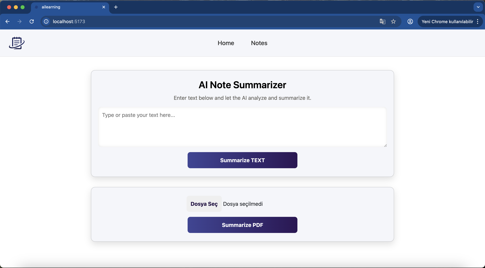
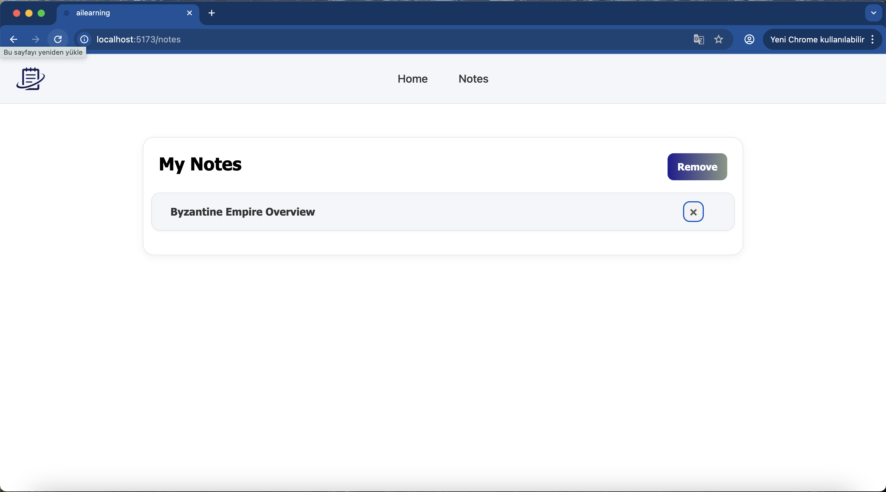
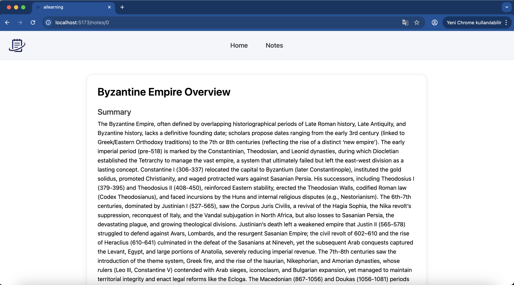
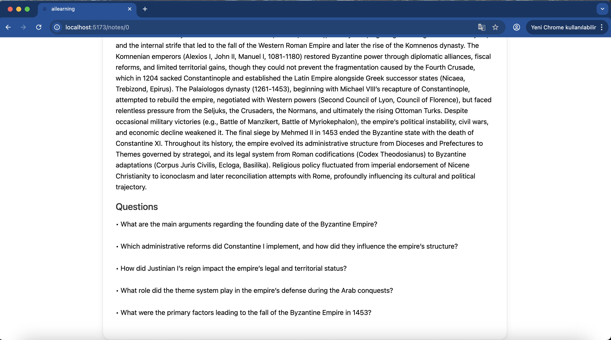

# 🚀 AI Text & PDF Summarizer

An AI-powered summarization tool built with **React**, **Redux**, **Express.js**, and **GPT-OSS**.

This application allows users to upload long text or PDF files, generate structured summaries, and automatically receive key questions extracted from the content.

---

## 🔥 Features

### 🧠 AI Integration
- Summarizes both text and PDF content using GPT-OSS.
- Generates meaningful questions based on the uploaded content.
- Returns strictly structured JSON for reliable parsing.

### 📄 Text & PDF Processing
- PDF upload support via Multer.
- Text extraction from PDFs using `pdfreader`.
- Direct text input support for quick summarization.

### ⚛️ Frontend (React)
- Built with React for a smooth user experience.
- Redux Toolkit for global state management.
- React Router with dynamic parameter-based routing.
- Clean and minimal UI layout.

### 🚀 Backend (Express.js)
- Structured API endpoints for text and PDF processing.
- Safe text processing and prompt generation.
- Handles multipart form data for file uploads.

---

## 🛠 Tech Stack

### Frontend
- React  
- Redux Toolkit  
- React Router  
- TypeScript (optional)  
- Fetch API  
- CSS  

### Backend
- Node.js  
- Express.js  
- Multer  
- pdfreader  
- HuggingFace Inference Client (GPT-OSS)  
- dotenv  
- CORS  

---
## Screenshots

### Home Page

### Note Page

### Summary Result

### Questions

